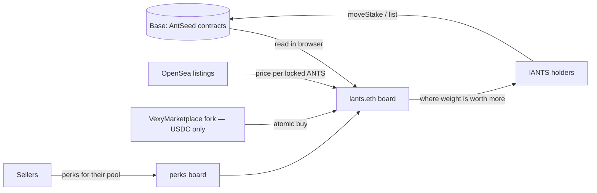

# lants-market

**A valuation board and market layer for locked ANTS positions (lANTS) on the AntSeed network.**

> Community-built. Not an official AntSeed product.

[](https://lants.eth.limo)
[](docs/protocol-notes.md)
[](https://lants.eth.limo)
[](LICENSE)

---

## Why this exists

Since the M001 activation (epoch 22), AntSeed rewards buyers, sellers and stakers in ANTS, and **ANTS
itself cannot be transferred**. Rewards can only be staked into a seller pool, and every stake mints
an **lANTS NFT** — an ordinary ERC-721 that *can* change hands.

That makes lANTS the only transferable exposure to ANTS today. OpenSea already indexes the
collection, but it cannot tell you what a position is worth: the amount, the lock, the pool and
the pending reward are invisible there.

Pool weight also decides where buyer rewards flow. Buying from a pool with weight ≈ 1 000 000 earns
points at that multiple; buying from a pool with weight ≈ 100 earns almost nothing. Weight is
becoming something sellers should care about — and pay for.

**lants-market answers two questions:**

1. **What is this position worth?** Every lANTS position with its real contents and, where a
   listing exists, the price per locked ANTS.
2. **What does a seller give for weight?** A public board of seller perks for stakers of their pool.

## What v1 is — and is not

| v1 does | v1 does not |
|---|---|
| Reads every position straight from Base in your browser | Hold anyone's NFTs or funds — purchases are atomic |
| Shows amount, lock, pool, weight, exit penalty, pending reward | Custody anything: the contract never holds NFTs or USDC |
| Links each position to its OpenSea page and shows the listing price per locked ANTS | Let the owner touch your money — owner can only change `feeRecipient` |
| Adds a thin USDC-only marketplace contract on Base (fork of Vexy) | Charge more than a fixed 1% fee on a completed purchase |
| Publishes seller perks for pool stakers | Duplicate pool analytics — [antseed-zh](https://antseed-zh.com) already does that well |

## How it fits together



## Run locally

The site is a static build — no server, it reads Base straight from the browser.

```bash
cd site && python -m http.server 8098
# then open http://127.0.0.1:8098   (use 127.0.0.1, not a LAN IP)
```

> The wallet (Privy) modal opens **only** on `localhost` / `127.0.0.1`. On a LAN IP it will not open.

Run the tests:

```bash
node site/metrics.test.mjs

git submodule update --init      # pulls lib/forge-std
cd contracts && forge test --fork-url https://mainnet.base.org   # fork tests on Base
```

Site checks (Playwright) live in `scripts/site/check_*.py`.

## Contract

- **VexyMarketplace** on Base: `0xC5BFc309a68dBf4e7eEca9BD91749d611c75C660`
- **Verified** on Basescan (<https://basescan.org/address/0xC5BFc309a68dBf4e7eEca9BD91749d611c75C660#code>, exact match), also on Blockscout (<https://base.blockscout.com/address/0xC5BFc309a68dBf4e7eEca9BD91749d611c75C660?tab=contract>) and Sourcify; built with Remix, solc 0.8.28, optimizer off.
- **Origin.** A fork of [Vexy](https://base.blockscout.com/address/0x6b478209974bd27e6cf661fef86c68072b0d6738)
  (veAERO market) by @0xValde. Our only functional change:
  `require(currency == USDC)` plus a USDC constant — listings are USDC-only. `Owned.sol` was
  replaced with a minimal MIT one (instead of Solmate under AGPL). Vexy source files keep their
  own `SPDX: UNLICENSED` header.
- **No custody, no rug surface.** The contract holds neither NFTs nor money. A seller lists without
  transferring the NFT; a purchase is atomic (USDC to seller, 1% fee to `feeRecipient`, NFT to
  buyer). The owner can change **only** `feeRecipient` — nothing else.
- `feeRecipient` today is the operator wallet `0x3d4CCcfAA3B25997F4ab33f838558521259Eef1B`.

## Data pipeline

A GitHub Actions job (`snapshot.yml`) publishes a fresh snapshot for each 06/14/22 UTC window. It wakes up
every hour and skips when the live snapshot is already fresh, so a delayed or dropped GitHub cron is caught up
within the hour. Each run builds a snapshot of
positions (`site/enrich-snapshot.mjs`, `site/enrich-sales.mjs`), gates it through
`site/sanity-check.mjs`, and publishes to IPNS. Filebase secrets live only in CI.

## Where to read next

| File | What is inside |
|---|---|
| [ROADMAP.md](ROADMAP.md) | Build-in-public roadmap, milestones, build log, metrics |
| [docs/protocol-notes.md](docs/protocol-notes.md) | How lANTS works: contracts, weights, penalties, rewards |
| [docs/network-snapshot-2026-09-17.md](docs/network-snapshot-2026-09-17.md) | Every number we rely on, with the command that produced it |
| [docs/market-research.md](docs/market-research.md) | What Vexy (veAERO market) teaches us, Seaport, OpenSea, the community landscape |
| [docs/decisions.md](docs/decisions.md) | Decision log with reasons |
| [scripts/probes/](scripts/probes/) | The on-chain probes behind the numbers |

## How it is built

The plan is written in one paid planning session. **All code is written by free models served on the
AntSeed network itself**, routed through [Akilon](https://akilon.ru), and every stage is accepted by a
human with commands, not by the model's own report.

## Reproduce the numbers

```bash
npm install
node scripts/probes/net-state.cjs       # positions, owners, pool weights next epoch
node scripts/probes/seller-rank.cjs 22  # recognized sales by seller for an epoch
```

## Contributing

Small PRs, one topic each, are welcome. See [CONTRIBUTING.md](CONTRIBUTING.md) for how to run,
test and open a PR, and what we can't accept.

## License

Our code is **MIT** (see [LICENSE](LICENSE)). The forked Vexy source files keep their original
`SPDX: UNLICENSED` header — MIT covers everything else in this repo.
